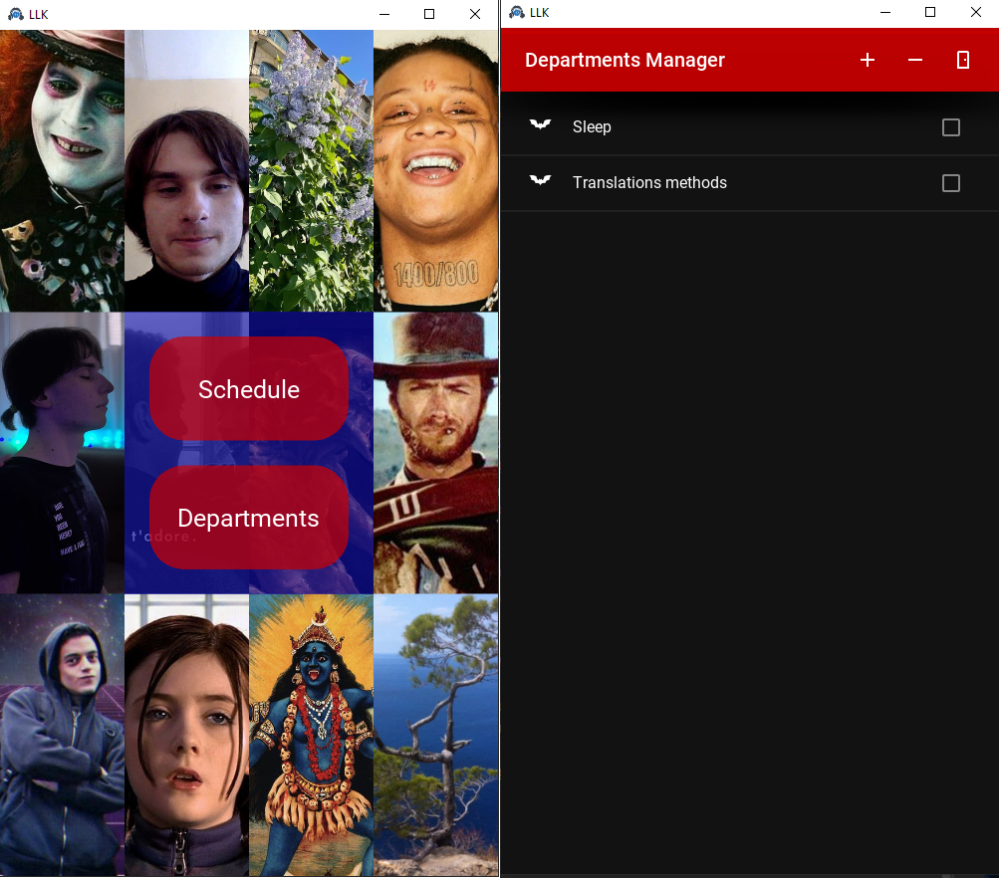
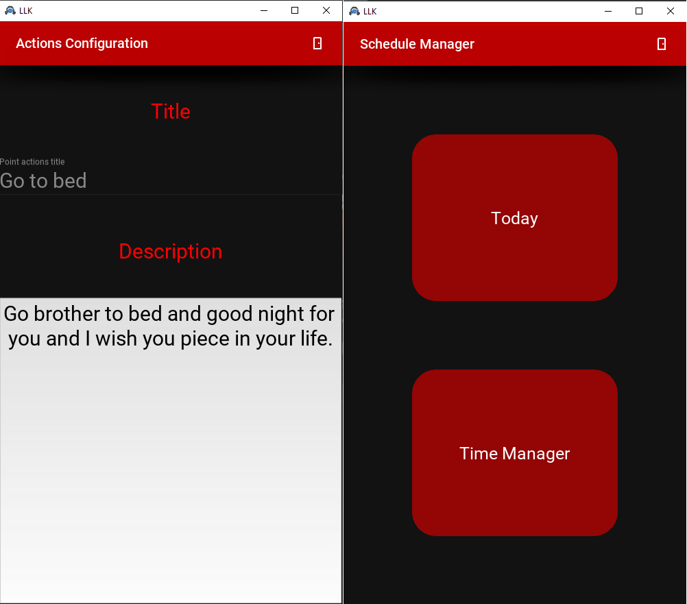
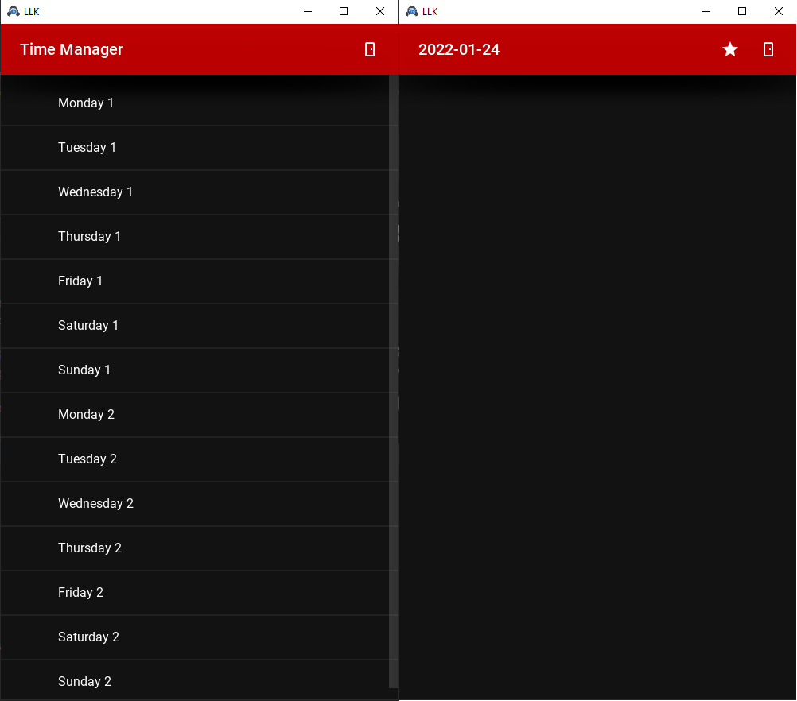

#Lila Loki Kali APP

####*There is an idea to create one app which is able to store my ideas, to sort them and help me to develop a good resolutions.*
###So, let's GO!

---
####Firstly, I'd like to highlight main parts of my future APP.
####1. *Menu of departments.*
>###It is something like:
>- ####*Dance*
>- ####*Programming*
>- ####*Money*
>- ####*Seduction*
>- ####*etc...*
####2. *Departments entities.*
####3. *Schedule!!!!!!!!!!!!!!!!!!!!!!!!!!!!*

----
####INDEPENDENCE
- ####***each department is a unique part of the app;***
- ####*it has a special architecture and*
####FLEXIBILITY
- ####*each department is able to work with another one or few...*
- ####*it gives a possibility to mix departments if it is needed*
####SOPHISTICATION
- ####*the best practises and technologies*

---
##The main purpose of this APP is in choosing actions in life to get a certain kind of results while I want to fallow such kind of rules.
##It is not a dream. Just a way in the ocean.

---
>##!!!REMEMBERING THE TREE OF WISHES!!!

So, actually it is written but not supports all the functions described here.
In the future they will be created.

